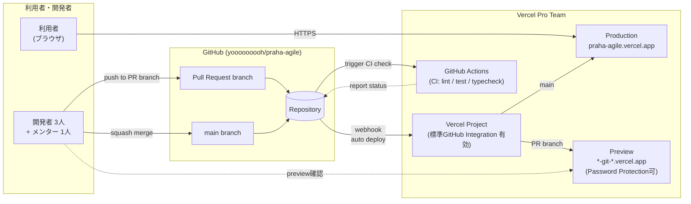

# インフラ・CI/CD 設計 spec

- 作成日: 2026-05-20
- 対象 Issue: [#2 インフラを考える人](https://github.com/yooooooooh/praha-agile/issues/2)
- スコープ: インフラ層（ホスティング / リポジトリ / CI/CD / 環境分離 / IaC）
- スコープ外: 認証、DB スキーマ、アプリ設計、ドメインロジック、監視詳細（すべて別 spec）

---

## 1. 選定方針

### このプロジェクトの前提

- プラハチャレンジ運営向け Web アプリの最終課題（学習成果物）
- 利用者：受講生 50 人以下、管理者（プラハ運営）数名
- 開発者：3 人 + メンター 1 人
- 目的：現在の Notion + Spreadsheet 運用を置き換え、退会者が Notion URL を知っていれば課題を見られる問題を解消

### この spec が最適化するもの

- **学習成果物としての提出・レビューしやすさ**：技術判断を後から説明できる粒度で残す
- **少人数開発での運用負担の最小化**：4 人開発・長期専任運用者なし
- **$0 スタートを可能にする**（Hobby 構成）／**商用利用も含む持続運用が選べる**（Pro 構成）
- **Next.js App Router との相性**
- **stg / production / preview の環境分離**（Issue #2 が明示）

### この spec が最適化しないもの

- スケーラビリティ・高可用性（受講生 50 人以下が前提）
- マルチリージョン・グローバル配信
- 監査・規制対応
- ユーザー数千〜数万を捌くトラフィック設計

---

## 2. 決定一覧

| 項目 | 決定 | 1 行理由 |
|---|---|---|
| リポジトリ | 個人 public (`yooooooooh/praha-agile`) | Hobby 制約を踏まず、課題提出の透明性も保てる |
| ホスティング | Vercel | Next.js App Router 公式サポート、Native Integration が豊富 |
| プラン | **Hobby と Pro の 2 案を併記**（後述） | 商用扱い回避なら Hobby、明確に運用するなら Pro |
| CI/CD | プラン別に 2 通り（後述） | プランによって Vercel の挙動が変わるため |
| 環境分離 | production / preview / local の 3 環境 | Issue #2 の「stg と本番、preview もあれば」要求に対応 |
| merge 方式 | squash merge 強制（rebase merge 禁止） | commit author を一意化し、Hobby の場合の制約に備える |
| IaC | `vercel.json` のみで開始、Terraform は採用しない | MVP 段階で Terraform は過剰、`vercel.json` で十分 |
| Cloudflare 前段配置 | 採用しない | Vercel 公式が reverse proxy 前段を推奨せず、`.vercel.app` バイパス問題あり |

---

## 3. 全体構成図

2 つのプラン構成それぞれの構成図を示す。利用者のアクセス経路は両プランで同じ、CI/CD の組み方が大きく異なる。

### 3.1 Hobby 構成（$0、学習成果物前提）

```mermaid
flowchart LR
    subgraph users["利用者・開発者"]
        EndUser["利用者<br/>(ブラウザ)"]
        Dev["開発者"]
    end

    subgraph github["GitHub (yooooooooh/praha-agile, public)"]
        Repo[("Repository")]
        PR["Pull Request<br/>branch"]
        Main["main branch"]
        Actions["GitHub Actions<br/>CI + CD"]
        Secrets[["GitHub Secrets<br/>VERCEL_TOKEN"]]
    end

    subgraph vercel["Vercel Hobby"]
        VProject["Vercel Project<br/>(標準GitHub Integration 無効)"]
        Prod["Production<br/>praha-agile.vercel.app"]
        Preview["Preview<br/>*-git-*.vercel.app"]
    end

    EndUser -->|HTTPS| Prod

    Dev -->|push to PR branch| PR
    Dev -->|squash merge (ownerのみ)| Main
    PR --> Repo
    Main --> Repo
    Repo -->|trigger| Actions
    Actions -.read.-> Secrets
    Actions -->|PR: vercel deploy --prebuilt| Preview
    Actions -->|main: vercel deploy --prebuilt --prod| Prod
    VProject -.owns.-> Prod
    VProject -.owns.-> Preview

    Dev -.preview確認.-> Preview
```

### 3.2 Pro 構成（$60〜$80/月、商用扱い OK）



### 3.3 2 つの構成の違い（要点）

| 観点 | Hobby 構成 | Pro 構成 |
|---|---|---|
| **deploy 主体** | GitHub Actions（`vercel deploy --prebuilt`） | Vercel 標準 GitHub Integration（webhook） |
| **GitHub Actions の役割** | CI + CD 両方 | CI のみ（lint/test/typecheck） |
| **commit author 制約** | 回避が必要（Actions 経由で対応） | なし |
| **VERCEL_TOKEN** | GitHub Secrets に必要 | 不要 |
| **main merge の担当** | masuyamayo さんに限定 | 誰でも OK |
| **Preview 保護** | Vercel Authentication のみ | Password Protection 利用可 |
| **商用扱い** | 非商用立て付け（グレー） | 明確に OK |
| **月額** | $0 | $60〜$80 |

---

## 4. 個別 ADR

### 4.1 ADR-1: リポジトリ形態は個人 public

**決定**: 個人アカウント配下の public repo `yooooooooh/praha-agile`

**要件**:
- Vercel Hobby を選んだ場合に Hobby の GitHub 制約を踏まないこと
- 課題レビュー・透明性を保てること
- 個人情報・secrets を含まないコードが原則であること

**比較**:

| 候補 | Hobby 適合 | 課題提出透明性 | 注意点 |
|---|---|---|---|
| **個人 public**（採用） | ⭕ | ⭕ | secrets を絶対コードに置かない規律が必要 |
| 個人 private | ⭕ | △（メンター招待が要る） | レビュー導線が増える |
| GitHub Org public | ⭕ | ⭕ | Org 管理コスト |
| GitHub Org private | ❌（Hobby 不可） | △ | Pro 必須 |

**理由**: Hobby/Pro どちらを選ぶ余地を残したい。Hobby 制約と最も相性が良いのは個人 public。

**リスク**: コードが公開されるので、secrets を絶対コードに含めない規律が必要。`.env` を `.gitignore` で除外、`.env.example` のみ commit。

**見直し条件**: 受講生の個人情報を含むコード片を公開できない強い要件が出たら private 化を検討。

---

### 4.2 ADR-2: ホスティングは Vercel

**決定**: Vercel を採用

**要件**:
- Next.js App Router を活用できる
- Preview Deployment が標準で提供される
- 4 人開発で運用負担が小さい
- $0 スタートが可能、または商用利用可の有料プランがある

**比較**:

| 候補 | 採用 | コメント |
|---|---|---|
| **Vercel**（採用） | ⭕ | Next.js 公式、Preview 標準、Native Integration 豊富 |
| Cloudflare Pages + Workers | ❌ | OpenNext 経由で Next.js 動くが、構成理解と検証コストが高い |
| AWS Amplify Hosting | ❌ | Next.js 対応はあるが、Vercel と比べて App Router の追随が遅い |
| Railway / Fly.io | ❌ | コンテナベース、Next.js のフルマネージドではない |
| self-host (VPS) | ❌ | 運用負担過大 |

**理由**:
- Next.js App Router は Vercel が開発元なので Day 1 でフル機能サポート
- Marketplace で Neon / Clerk / Auth0 / Supabase などの Native Integration が揃っており、後で認証・DB を別 spec で決める時の選択肢が広い
- Preview Deployment が標準で、Issue #2 の「preview もあれば」要件をプラン問わず満たす

**リスク**: Vercel への vendor lock-in。ただし Next.js 自体は OSS なので、最悪 OpenNext などで他基盤に移せる。

**見直し条件**: 月額コストが許容を超える／Vercel が大幅な仕様変更を行い MVP 運用に支障が出る場合。

---

### 4.3 ADR-3: プランは Hobby と Pro の 2 案を併記

**決定**: 本 spec ではどちらか一方に決め打ちせず、**Hobby と Pro の 2 構成を併記**する。実運用フェーズで最終決定する。

**要件**:
- 「課題＝学習成果物」として扱う限り Hobby が選べる
- 「契約周り」（Issue #2 本文）を踏まえると Pro も現実的選択肢
- 後から切り替え可能な状態を維持

**Hobby を選ぶ場合の条件**:
- 利用は課題提出・評価期間のデモ運用に限定する
- 本番運営データ（実受講生の個人情報・課題本文）を継続的には入れない
- 受講生に実ログインさせて業務的に運用するフェーズに入らない

**Pro を選ぶ場合の条件**:
- プラハ運営が実業務として運用する意思決定がされる
- 開発体験（Preview の commit author 制約解消、Password Protection 等）を優先したい
- 月額 $60〜$80 を支払う合意が取れる

**Vercel Hobby の制約（事実）**:
- Hobby は personal / non-commercial use 専用（公式 fair use guidelines）
- GitHub Org private repo からの deploy 不可
- deploy commit author が Hobby team owner と一致する必要あり
- Preview Deployment Protection は Vercel Authentication のみ

**Vercel Pro のコスト感**:
- Team seat $20/month per paid member
- Pro Viewer は無料（read-only、deploy 不可）

| Pro 構成案 | 月額 | 内訳 |
|---|---|---|
| 開発者 3 人 を Pro Member、メンターを Pro Viewer | **$60** | $20 × 3 |
| 全 4 人を Pro Member | **$80** | $20 × 4 |

**理由**: 学習成果物として MVP を作る現段階では Hobby が成立する。一方で Issue #2 が「契約周り」も検討対象としているため、Pro 構成も後で選べるように設計を残す。

**見直し条件**: プラハ運営が業務として常用する判断をした時点で Pro へ移行。

---

### 4.4 ADR-4: CI/CD はプラン別に 2 通り

**Hobby 構成: GitHub Actions + Vercel CLI deploy**

**決定**: `vercel build` + `vercel deploy --prebuilt --token=...` を GitHub Actions から実行する

**理由**:
- Hobby の commit author 制約は token deploy なら回避できる（Actions の token は masuyamayo さんの権限で動く）
- public repo の場合、Hobby の標準 GitHub Integration でも commit author 制約に当たる可能性があるため保険になる
- CI（lint/test/typecheck）と CD（deploy）を同じ workflow に統合できる
- 将来 Pro に上げる／Cloudflare 等に乗り換える場合も Actions の deploy step 差し替えで済み、可搬性が高い

**実装方針**:
- `.github/workflows/ci.yml`: PR 時に lint/test/typecheck を実行
- `.github/workflows/deploy-preview.yml`: PR push 時に Preview deploy + URL を PR コメント
- `.github/workflows/deploy-production.yml`: `main` push 時に Production deploy
- secrets: `VERCEL_TOKEN`, `VERCEL_ORG_ID`, `VERCEL_PROJECT_ID` を GitHub Secrets に
- **Vercel 標準 GitHub Integration は無効化**（二重 deploy 回避）

**セキュリティ上の規律**（public repo + Actions deploy 固有）:
- `pull_request_target` は使わない（fork PR からの code injection 経路になる）
- fork PR には secrets を渡さない（GitHub Actions のデフォルト挙動。明示的に有効化しない）
- Preview deploy を動かす範囲を「owner と信頼できる collaborator が出した PR」に限定する
- `.env.example` には実値を絶対に書かない

**Pro 構成: Vercel 標準 GitHub Integration + GitHub Actions (CI のみ)**

**決定**: deploy は Vercel の webhook 経由、GitHub Actions は CI（lint/test/typecheck）のみを担う

**理由**:
- Pro は commit author 制約がないので、Vercel 標準 Integration の旨味をフル活用できる
- Actions に VERCEL_TOKEN を持たせる必要がなくなり、運用がシンプル
- PR コメント、Preview URL、Comments on Preview 等の Vercel 標準 DX がそのまま使える

**実装方針**:
- `.github/workflows/ci.yml`: PR 時に lint/test/typecheck を実行し、status を PR に報告
- deploy は Vercel が GitHub webhook 経由で自動実行
- secrets: なし（VERCEL_TOKEN 不要）

**共通の運用ルール**:
- merge 方式は **squash merge 強制**（rebase merge は GitHub 設定で禁止）
- Hobby の場合: `main` への merge は masuyamayo さん（Vercel Hobby team owner）が押す
- Pro の場合: 誰が押しても OK

**見直し条件**:
- Hobby 構成で Actions 保守が負担になる → Pro へ移行
- Pro 構成で Vercel 標準 Integration に不満が出る → Actions deploy に変更

---

### 4.5 ADR-5: 環境分離は production / preview / local

**決定**: 3 環境構成。Issue #2 の「stg と本番、preview もあれば」要件に対応する。

**環境マッピング**:

| 環境名 | Git branch | Vercel Environment | 用途 |
|---|---|---|---|
| **production** | `main` | Production | 本番運用（または評価期間のデモ） |
| **preview** | PR branch / 任意の非 main branch | Preview | 機能確認・レビュー |
| **local** | 開発者ローカル | （Vercel 外） | 個人開発 |

**「stg」を明示的に別環境として持つかどうか**:
- 現状は持たない。PR ごとの Preview deployment が事実上の stg 役割を果たす
- 必要になったら、`staging` 長命 branch を切り、Vercel の Custom Environment 機能（Pro 機能）で stg として明示することは可能
- Hobby ではこの拡張ができないため、必要になった時点で Pro 移行と同時に検討

**環境変数の責任分界**:

| 種類 | 置き場所 | 例 |
|---|---|---|
| Actions が deploy に使う credentials | GitHub Secrets | `VERCEL_TOKEN`, `VERCEL_ORG_ID`, `VERCEL_PROJECT_ID` |
| アプリ実行時に使う credentials | Vercel Project Env（環境ごと設定） | 認証 SDK key, DB URL 等（具体は別 spec） |
| local 開発用 | `.env.local`（git 管理外） | dev 用の値 |
| ドキュメント用 | `.env.example`（git commit、ダミー値のみ） | キー一覧のみ |

**見直し条件**: stg を独立環境として持ちたい強い要件が出たら Vercel Custom Environment（Pro 機能）で実現。

---

### 4.6 ADR-6: IaC は `vercel.json` のみで開始

**決定**: 当面は `vercel.json` 1 ファイルで Vercel 側の設定を Git 管理する。Terraform 等は採用しない。

**要件**:
- Issue #2 が「簡単な IaC」と書いている
- MVP 段階で過剰な仕組みを入れない

**比較**:

| 候補 | 採用 | コメント |
|---|---|---|
| **`vercel.json` のみ**（採用） | ⭕ | Cron / Routing / Function 設定を Git 管理できる |
| Terraform Provider for Vercel | ❌ | Project / Domain / Env まで管理できるが MVP には過剰 |
| Vercel CLI スクリプト | ❌ | 自前管理は脆い |

**`vercel.json` に書くもの**:
- 必要であれば Function の region / memory / maxDuration 設定
- Cron Jobs（今は未定）
- redirects / headers（今は未定）

**Vercel Dashboard 側で管理するもの**（コード管理外）:
- Project の作成
- GitHub 連携
- 環境変数の実値

**見直し条件**:
- Project 数が増えた、複数環境を厳密に管理したい等の要件が出たら Terraform 導入を検討

---

### 4.7 ADR-7: Cloudflare 前段配置は採用しない

**決定**: Vercel の前段に Cloudflare（Pages / Workers / Access）を置く構成は採用しない。

**理由**:
- Vercel 公式が reverse proxy を前段に置く構成を積極推奨していない（traffic visibility、Firewall、cache 管理、レイテンシへの影響）
- `.vercel.app` の直叩きで Cloudflare をバイパスされうる
- 今回のスコープ（インフラ）では特に必要性がない

**見直し条件**:
- 認証 spec で Cloudflare Access を再評価する場合（ただし現在の方向性では採用しない）

---

## 5. 対象外（別 spec で扱う）

以下は本 spec では決定しない:

- **認証プロバイダの選定**（Clerk / Auth.js / Auth0 / Cloudflare Access 等）→ 別 spec
- **DB の選定**（Neon / Supabase 等）と詳細設計 → 別 spec
- **DB スキーマ・migration 方針** → 別 spec
- **ORM の選定**（Drizzle / Prisma / Kysely 等）→ 別 spec
- **App Router のアプリ分離方針**（単一アプリ + Route Groups / monorepo 分割）→ 別 spec
- **認可モデル**（role / status / 退会者ブロック）→ 別 spec
- **監視・ログ設計** → 別 spec
- **カスタムドメイン**（当面は `.vercel.app` で運用）→ 必要になったら別 spec

---

## 6. ガードレール（共通）

プラン選択に関わらず守るべきルール:

- リポジトリは public 維持。secrets を絶対にコード・コミット・PR 本文・Issue 本文に書かない
- secrets は GitHub Secrets / Vercel Project Env のみに保管
- `.env` は `.gitignore`、`.env.example` のみ commit
- merge 方式は squash 強制、rebase merge は GitHub 設定で禁止
- 受講生の個人情報を本物データとして本番 DB に投入しない（seed / test データのみ）
- 本番 DB を Preview 環境から読み書きしない（環境変数で分離）

---

## 7. 見直し条件のまとめ

| 項目 | 見直しトリガ | 移行先 |
|---|---|---|
| Hobby → Pro | プラハ運営が業務として常用する判断、または開発体験の悪化 | Vercel Pro |
| Actions deploy → 標準 Integration | Pro 移行と同時、または Actions 保守が負担になった時 | Vercel 標準 GitHub Integration |
| `.vercel.app` → custom domain | プロダクトとして公開する判断が出た時 | Vercel custom domain（年間ドメイン代別途） |
| `vercel.json` → Terraform | Project / 環境管理が複雑化した時 | Terraform Provider for Vercel |
| public repo → private repo | 個人情報を含むコードを置く必要が出た時 | private repo（Vercel Pro 必須） |
| 単一 Vercel project → 分割 | admin / user の独立 deploy 要件が出た時 | アプリ設計 spec で別途検討 |

---

## 付録 A: 月額コスト試算

### Hobby 構成

| サービス | プラン | 月額 | 備考 |
|---|---|---|---|
| Vercel | Hobby | $0 | Function 100 万 invocations 等 |
| GitHub Actions | Free (public repo) | $0 | 無制限 |
| ドメイン | `.vercel.app` | $0 | カスタムドメイン使うなら別途年 $12 程度 |
| **合計** | | **$0 / 月** | |

### Pro 構成

| サービス | プラン | 月額 | 備考 |
|---|---|---|---|
| Vercel Pro | Team 3 seats（メンター Viewer） | $60 | 開発者 3 人を Member |
| GitHub Actions | Free (public repo) | $0 | 無制限 |
| ドメイン | `.vercel.app` | $0 | 同上 |
| **合計** | | **$60 / 月** | |

Pro Team に全員（4 人）を Member 化する場合は $80 / 月。

### 認証・DB を含めた最終コストの目安（参考。詳細は別 spec）

| 想定 | Hobby 構成合算 | Pro 構成合算 |
|---|---|---|
| Clerk Free + Neon Free | $0 | $60 |
| Clerk Pro + Neon Launch | $44 | $104 |

---

## 付録 B: 参考リンク

- [Vercel Hobby plan](https://vercel.com/docs/plans/hobby)
- [Vercel fair use guidelines](https://vercel.com/docs/limits/fair-use-guidelines)
- [Vercel Pro plan](https://vercel.com/docs/plans/pro-plan)
- [Vercel for GitHub](https://vercel.com/docs/git/vercel-for-github)
- [How can I use GitHub Actions with Vercel](https://vercel.com/docs/git/vercel-for-github#using-github-actions)
- [Vercel Marketplace](https://vercel.com/marketplace)
