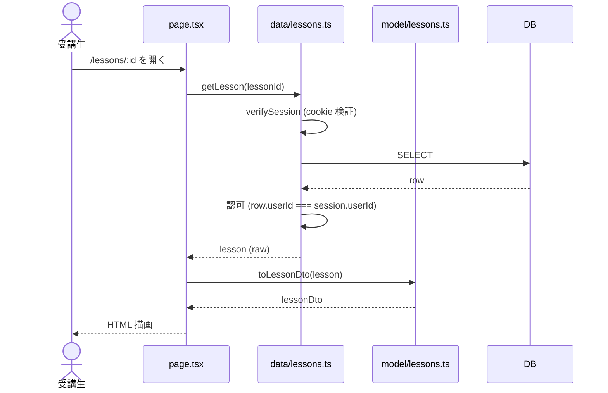
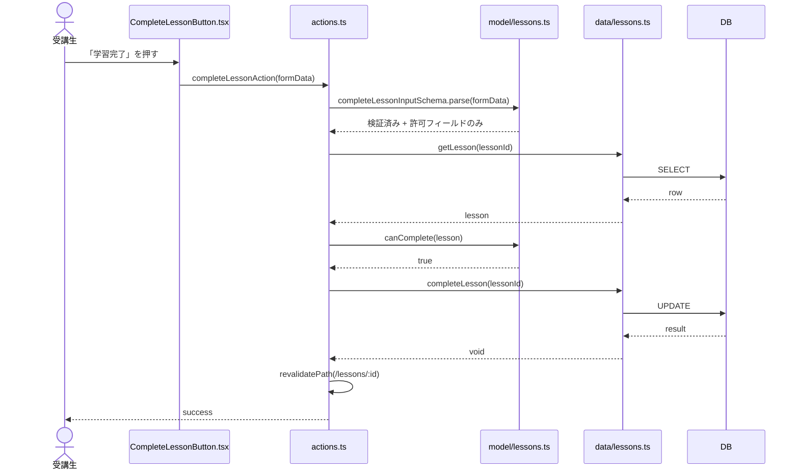

# Server Actions + Data Access Layer による開発フロー提案

- 作成日: 2026-05-22
- 開発体制: 実装 3 人 + PO 1 人 = 計 4 人
- 関連 spec: [2026-05-20 インフラ設計](./2026-05-20-infrastructure-design.md)

---

## 1. この提案

このドキュメントは、プラハチャレンジのアプリ(受講生向け `student` / 運営向け `admin`)を Next.js App Router で構築するにあたり、**Next.js 公式が推奨する Server Actions と Data Access Layer (DAL) の流儀に従いつつ、シンプルで処理が追いやすい開発フローを今のうちに固める**ことを提案するものです。

具体的には:

- **ドメインルールを `model/` ファイルに閉じ込める** (どこで何が起きるか迷わない)
- **`app/<route>/actions.ts` を薄いオーケストレーションに保つ** (Server Action は入力検証と委譲のみ)
- **DB アクセスと認可を `data/` に集約する** (公式の DAL パターンに準拠)

このドキュメントを共通認識として共有することで、機能追加のたびに「どこにどう書くか」を議論する手間を削り、爆速で機能開発を進めることを期待しています。

---

## 2. 基本方針

### 2.1. 選定ライブラリ

- Next.js v16.2.6
- React v19.2.4
- TypeScript v5
- Tailwind CSS v4
- Drizzle ORM v0.45.2
- Drizzle Kit v0.31.10
- Zod v3
- Radix UI v1
- Vitest v4.1.7
- Biome v2.4
- pnpm v9.15.0
- Turborepo v2
- Node.js v22+

### 2.2. ディレクトリ設計 (モノレポ)

モノレポの推奨プラクティスに沿って、TypeScript / Biome の設定は独立したパッケージとして分離する ([Turborepo: Managing TypeScript](https://turborepo.com/docs/guides/tools/typescript))。

| パッケージ | 内容 |
|---|---|
| `apps/student` | 受講生向け Next.js アプリ |
| `apps/admin` | 運営向け Next.js アプリ |
| `packages/db` | Drizzle client + schema + migrations |
| `packages/typescript-config` | TypeScript 設定 (base / nextjs / library) |
| `packages/biome-config` | Biome 設定 |

各アプリ内のディレクトリ構成:

| ディレクトリ | 内容 |
|---|---|
| `app/` | Next.js App Router (routing と薄い page / actions / layout / error) |
| `data/` | 認可付きデータアクセス層 (server-only) |
| `model/` | エンティティ定義 (型・Zod schema・ドメインの不変条件・DTO 変換) |
| `components/` | アプリ内横断 UI |

### 2.3. なぜ `data/` と `model/` を分けるか

#### 分けない場合 (`data/` のみで進める)

DB アクセス、認可、型、ドメインの不変条件、DTO 変換を `data/lessons.ts` に同居させると、`data/` 全体に `import "server-only"` がかかるため、**Client Component から型・ルール・DTO を import するとビルドエラーになる**。

この制約のもとで開発を進めると次の問題が生じる:

- **ドメインの不変条件の重複**: ボタンの活性制御 (例: 「完了済みなら学習完了ボタンを disabled」) のために、`canComplete` を Client 側で再実装する必要が出る。Server 判定と Client 表示の乖離が起きやすい
- **入力 schema の重複**: 同じ Zod schema を Server Action 検証と Client フォーム検証で共有できず、二重定義になる
- **DTO 型の重複**: `LessonDto` を Client が知れないため、Client Component の props 型を都度手書きする
- **生 row を Client に渡す事故**: 型レベルで「公開してよい形」と「内部 row」が分離されないため、`db.select()` の結果を直接 Client Component に渡してしまうコードが書かれうる

#### 分ける場合 (`data/` + `model/`)

分けることで生じるデメリット:

- ファイル数が増える (各 entity で `data/<entity>.ts` と `model/<entity>.ts` の 2 ファイル)
- `toLessonDto` の呼び出しを `page.tsx` / `actions.ts` 側で行うため、呼び忘れると生 row が Client Component に渡るリスクが残る
- 型が 2 種類に分かれる (`Lesson` 内部型 / `LessonDto` 公開型) ため、両者の対応を意識する必要がある

これらは規律 (`AGENTS.md` + コードレビュー) で抑えられる範囲。

#### 結論: 分ける

`server-only` の境界が **物理的にディレクトリで表現される** ことと、ドメインの不変条件と DTO 型が **Server / Client の両方から再利用できる** ことの方が、ファイル数増加のコストより大きい。Next.js 公式は **server / client コードの混在 (environment poisoning) を構造的に防ぐ** ことを推奨しており、ディレクトリ分離はこの推奨を具現化する手段。

根拠:

> サーバー専用コードがクライアントで実行されないようにするには、モジュールを `server-only` パッケージでマークできます。これにより、独自コードや内部ビジネスロジックがサーバー上に留まり、クライアント環境で import されるとビルドエラーが発生します。
>
> "To prevent server-only code from being executed on the client, you can mark a module with the server-only package. This ensures that proprietary code or internal business logic stays on the server by causing a build error if the module is imported in the client environment."
>
> — [Next.js: Data Security — Preventing client-side execution of server-only code](https://nextjs.org/docs/app/guides/data-security#preventing-client-side-execution-of-server-only-code)

> サーバー専用コードをクライアントにバンドルしてしまったり、クライアント専用コードをサーバーで実行してしまうと意図しない結果を招きうる。Next.js は `server-only` / `client-only` パッケージでこの境界を明確にする手段を提供する。
>
> "Bundling server-only code into the client, or running client-only code on the server, can lead to unintended consequences... Next.js provides the server-only and client-only packages to help you make this distinction clear."
>
> — [Next.js: Server and Client Components — Preventing environment poisoning](https://nextjs.org/docs/app/getting-started/server-and-client-components#preventing-environment-poisoning)

#### 命名について

`model/` は FSD (Feature-Sliced Design) の `model` segment に倣った命名。`entity/` も候補だったが DDD の「Entity (識別子と寿命を持つオブジェクト)」とずれるため避けた。`domain/` は範囲が広すぎ、`core/` は汎用すぎるため、最も意味が近い `model/` を選んでいる。

---

## 3. 開発フロー: 新機能を追加する時

**エラーハンドリングのライブラリ (neverthrow 等) については本ドキュメントでは言及しない。throw + Next.js の `error.tsx` boundary で十分という現状の方針については §4.5 を参照。**

### 3.1. リクエスト処理の流れ (実行時)

#### GET (page 表示)



#### Mutation (フォーム送信)



### 3.2. パターン 1: 受講生が課題を完了する (student アプリ)

ユースケース: 受講生がレッスン詳細画面で「学習完了」ボタンを押し、課題を完了状態にする。

追加するファイル:

```
apps/student/
├── app/(authed)/lessons/[lessonId]/
│   ├── page.tsx
│   ├── actions.ts
│   ├── CompleteLessonButton.tsx
│   └── error.tsx
├── data/lessons.ts
└── model/
    ├── lessons.ts
    └── lessons.test.ts
```

実装順は **model → data → actions → Client Component → page → error** (依存される側から書く)。

#### 1. `model/lessons.ts`

```ts
// model/lessons.ts
import type { InferSelectModel } from "drizzle-orm"
import type { lessons } from "@praha-agile/db/schema"
import { z } from "zod"

export type Lesson = InferSelectModel<typeof lessons>

// 公開してよいフィールドのみを抜き出した DTO 型
export type LessonDto = Pick<Lesson, "id" | "title" | "description"> & {
  completed: boolean
}

// DTO 変換 (Client Component に渡す直前で呼ぶ)
export function toLessonDto(lesson: Lesson): LessonDto {
  return {
    id: lesson.id,
    title: lesson.title,
    description: lesson.description,
    completed: lesson.completedAt !== null,
  }
}

// 入力 schema (Server Action とフォームの両方で使う)
export const completeLessonInputSchema = z.object({
  lessonId: z.string().uuid(),
})
export type CompleteLessonInput = z.infer<typeof completeLessonInputSchema>

// ドメインの不変条件: 未完了のレッスンのみ完了できる
export function canComplete(lesson: Pick<Lesson, "completedAt">): boolean {
  return lesson.completedAt === null
}
```

#### 2. `data/lessons.ts`

`verifySession` は `data/auth.ts` に置く (認証プロバイダの選定は別 spec)。

```ts
// data/auth.ts
import "server-only"
import { cache } from "react"
import { redirect } from "next/navigation"

export const verifySession = cache(async () => {
  const session = await getSessionFromCookie()   // 認証プロバイダ依存(別 spec)
  if (!session) redirect("/login")
  return { userId: session.userId, role: session.role }
})
```

```ts
// data/lessons.ts
import "server-only"
import { cache } from "react"
import { eq } from "drizzle-orm"
import { db } from "@praha-agile/db"
import { lessons } from "@praha-agile/db/schema"
import { verifySession } from "@/data/auth"

// React の cache() で同一リクエスト内の同引数呼び出しを memo 化する
// cache はキャッシュキーを引数の参照同一性で比較するため、引数はプリミティブで渡す
// 根拠: "cache lets you cache the result of a data fetch or computation." — https://react.dev/reference/react/cache
export const getLesson = cache(async (lessonId: string) => {
  const session = await verifySession()
  const [lesson] = await db.select().from(lessons).where(eq(lessons.id, lessonId)).limit(1)
  if (!lesson) return null
  if (lesson.userId !== session.userId) throw new Error("Forbidden")
  return lesson
})

export async function completeLesson(lessonId: string) {
  // getLesson 経由で取得することで `verifySession` と ownership 認可が再実行される
  const lesson = await getLesson(lessonId)
  if (!lesson) throw new Error("Not found")
  await db
    .update(lessons)
    .set({ completedAt: new Date() })
    .where(eq(lessons.id, lessonId))
}
```

#### 3. `app/(authed)/lessons/[lessonId]/actions.ts`

```ts
// app/(authed)/lessons/[lessonId]/actions.ts
"use server"
import { revalidatePath } from "next/cache"
import { completeLessonInputSchema, canComplete } from "@/model/lessons"
import { getLesson, completeLesson } from "@/data/lessons"

export async function completeLessonAction(formData: FormData) {
  const parsedInput = completeLessonInputSchema.parse({
    lessonId: formData.get("lessonId"),
  })
  const lesson = await getLesson(parsedInput.lessonId)
  if (!lesson) throw new Error("Not found")
  if (!canComplete(lesson)) throw new Error("既に完了しています")
  await completeLesson(parsedInput.lessonId)
  // 該当 path の Server Component の cache を invalidate
  // 根拠: "revalidatePath allows you to purge cached data on-demand for a specific path." — https://nextjs.org/docs/app/api-reference/functions/revalidatePath
  revalidatePath(`/lessons/${parsedInput.lessonId}`)
}
```

#### 4. `app/(authed)/lessons/[lessonId]/CompleteLessonButton.tsx`

```tsx
// app/(authed)/lessons/[lessonId]/CompleteLessonButton.tsx
"use client"
import { completeLessonAction } from "./actions"

export function CompleteLessonButton({
  lessonId,
  completed,
}: { lessonId: string; completed: boolean }) {
  return (
    <form action={completeLessonAction}>
      <input type="hidden" name="lessonId" value={lessonId} />
      <button type="submit" disabled={completed}>
        <span>{completed ? "☑" : "☐"}</span> 学習完了
      </button>
    </form>
  )
}
```

#### 5. `app/(authed)/lessons/[lessonId]/page.tsx`

```tsx
// app/(authed)/lessons/[lessonId]/page.tsx
import { notFound } from "next/navigation"
import { getLesson } from "@/data/lessons"
import { toLessonDto } from "@/model/lessons"
import { CompleteLessonButton } from "./CompleteLessonButton"

export default async function Page({ params }: { params: { lessonId: string } }) {
  const lesson = await getLesson(params.lessonId)
  if (!lesson) notFound()
  const lessonDto = toLessonDto(lesson)
  return (
    <article>
      <h1>{lessonDto.title}</h1>
      <p>{lessonDto.description}</p>
      <CompleteLessonButton lessonId={lessonDto.id} completed={lessonDto.completed} />
    </article>
  )
}
```

#### 6. `app/(authed)/lessons/[lessonId]/error.tsx`

`actions.ts` や `data/lessons.ts` から throw されたエラーをこの境界で捕捉する。

```tsx
// app/(authed)/lessons/[lessonId]/error.tsx
"use client"

export default function Error({
  error,
  reset,
}: { error: Error; reset: () => void }) {
  return (
    <div role="alert">
      <p>エラーが発生しました: {error.message}</p>
      <button type="button" onClick={reset}>もう一度試す</button>
    </div>
  )
}
```

### 3.3. パターン 2: 運営が対象生徒のレッスンを開放する (admin アプリ)

ユースケース: 受講生から「次のレッスンを開放してほしい」というリクエストが出ている時、運営が承認して開放する。エンティティは **`LessonAccessRequest`** (アクセス申請のレコード)。

追加するファイル:

```
apps/admin/
├── app/(authed)/users/[userId]/lessons/
│   ├── page.tsx
│   ├── actions.ts
│   ├── ApproveLessonAccessButton.tsx
│   └── error.tsx
├── data/lesson-access-requests.ts
└── model/
    ├── lesson-access-requests.ts
    └── lesson-access-requests.test.ts
```

#### 1. `model/lesson-access-requests.ts`

```ts
// model/lesson-access-requests.ts
import type { InferSelectModel } from "drizzle-orm"
import type { lessonAccessRequests } from "@praha-agile/db/schema"
import { z } from "zod"

export type LessonAccessRequest = InferSelectModel<typeof lessonAccessRequests>

export type LessonAccessRequestDto = Pick<
  LessonAccessRequest,
  "userId" | "lessonId" | "requestedAt"
> & {
  approved: boolean
}

export function toLessonAccessRequestDto(
  request: LessonAccessRequest,
): LessonAccessRequestDto {
  return {
    userId: request.userId,
    lessonId: request.lessonId,
    requestedAt: request.requestedAt,
    approved: request.approvedAt !== null,
  }
}

export const approveLessonAccessInputSchema = z.object({
  userId: z.string().uuid(),
  lessonId: z.string().uuid(),
})
export type ApproveLessonAccessInput = z.infer<typeof approveLessonAccessInputSchema>

// ドメインの不変条件: まだ承認されていない申請のみ承認できる
export function canApprove(
  request: Pick<LessonAccessRequest, "approvedAt">,
): boolean {
  return request.approvedAt === null
}
```

#### 2. `data/lesson-access-requests.ts`

```ts
// data/lesson-access-requests.ts
import "server-only"
import { cache } from "react"
import { and, eq } from "drizzle-orm"
import { db } from "@praha-agile/db"
import { lessonAccessRequests } from "@praha-agile/db/schema"
import { verifySession } from "@/data/auth"
import type { LessonAccessRequest } from "@/model/lesson-access-requests"

// cache はキャッシュキーを引数の参照同一性で比較するため、引数はプリミティブで渡す
export const getLessonAccessRequest = cache(
  async (
    userId: string,
    lessonId: string,
  ): Promise<LessonAccessRequest | null> => {
    const session = await verifySession()
    if (session.role !== "admin") throw new Error("Forbidden")
    const [request] = await db
      .select()
      .from(lessonAccessRequests)
      .where(
        and(
          eq(lessonAccessRequests.userId, userId),
          eq(lessonAccessRequests.lessonId, lessonId),
        ),
      )
      .limit(1)
    return request ?? null
  },
)

export const listLessonAccessRequestsByUser = cache(
  async (userId: string): Promise<LessonAccessRequest[]> => {
    const session = await verifySession()
    if (session.role !== "admin") throw new Error("Forbidden")
    return db
      .select()
      .from(lessonAccessRequests)
      .where(eq(lessonAccessRequests.userId, userId))
  },
)

export async function approveLessonAccessRequest(
  userId: string,
  lessonId: string,
) {
  const session = await verifySession()
  if (session.role !== "admin") throw new Error("Forbidden")
  await db
    .update(lessonAccessRequests)
    .set({ approvedAt: new Date(), approvedBy: session.userId })
    .where(
      and(
        eq(lessonAccessRequests.userId, userId),
        eq(lessonAccessRequests.lessonId, lessonId),
      ),
    )
}
```

#### 3. `app/(authed)/users/[userId]/lessons/actions.ts`

```ts
// app/(authed)/users/[userId]/lessons/actions.ts
"use server"
import { revalidatePath } from "next/cache"
import { approveLessonAccessInputSchema, canApprove } from "@/model/lesson-access-requests"
import {
  getLessonAccessRequest,
  approveLessonAccessRequest,
} from "@/data/lesson-access-requests"

export async function approveLessonAccessAction(formData: FormData) {
  const parsedInput = approveLessonAccessInputSchema.parse({
    userId: formData.get("userId"),
    lessonId: formData.get("lessonId"),
  })
  const request = await getLessonAccessRequest(parsedInput.userId, parsedInput.lessonId)
  if (!request) throw new Error("申請が見つかりません")
  if (!canApprove(request)) throw new Error("既に承認済みです")
  await approveLessonAccessRequest(parsedInput.userId, parsedInput.lessonId)
  revalidatePath(`/users/${parsedInput.userId}/lessons`)
}
```

#### 4. `app/(authed)/users/[userId]/lessons/ApproveLessonAccessButton.tsx`

```tsx
// app/(authed)/users/[userId]/lessons/ApproveLessonAccessButton.tsx
"use client"
import { approveLessonAccessAction } from "./actions"

export function ApproveLessonAccessButton({
  userId,
  lessonId,
  approved,
}: { userId: string; lessonId: string; approved: boolean }) {
  return (
    <form action={approveLessonAccessAction}>
      <input type="hidden" name="userId" value={userId} />
      <input type="hidden" name="lessonId" value={lessonId} />
      <button type="submit" disabled={approved}>
        <span>{approved ? "☑" : "☐"}</span> 開放を承認
      </button>
    </form>
  )
}
```

#### 5. `app/(authed)/users/[userId]/lessons/page.tsx`

```tsx
// app/(authed)/users/[userId]/lessons/page.tsx
import { listLessonAccessRequestsByUser } from "@/data/lesson-access-requests"
import { toLessonAccessRequestDto } from "@/model/lesson-access-requests"
import { ApproveLessonAccessButton } from "./ApproveLessonAccessButton"

export default async function Page({ params }: { params: { userId: string } }) {
  const requests = await listLessonAccessRequestsByUser(params.userId)
  const requestDtos = requests.map(toLessonAccessRequestDto)
  return (
    <ul>
      {requestDtos.map((requestDto) => (
        <li key={requestDto.lessonId}>
          レッスン {requestDto.lessonId}
          <ApproveLessonAccessButton
            userId={requestDto.userId}
            lessonId={requestDto.lessonId}
            approved={requestDto.approved}
          />
        </li>
      ))}
    </ul>
  )
}
```

#### 6. `app/(authed)/users/[userId]/lessons/error.tsx`

パターン 1 と同じ形 (省略)。

### 3.4. パターン 3: 複数エンティティをまたぐ操作

機能拡張で「**レッスン完了時に特定条件で入社案内メッセージを送る**」のように複数エンティティへの書き込みが必要になることがある。**基本ルール**:

- `data/<entity>.ts` は単一エンティティに閉じる (`data/lessons.ts` が `data/job-invitations.ts` を呼ばない)
- 複数エンティティのオーケストレーションは `actions.ts` の責務として並列に並べる
- 送信可否のような **判定ルールは `model/` の純粋関数** に置く

```ts
// model/lessons.ts (追加部分)
export function shouldSendJobInvitation(
  lesson: Pick<Lesson, "isFinalLesson">,
): boolean {
  return lesson.isFinalLesson
}
```

```ts
// app/(authed)/lessons/[lessonId]/actions.ts
"use server"
import { revalidatePath } from "next/cache"
import {
  completeLessonInputSchema,
  canComplete,
  shouldSendJobInvitation,
} from "@/model/lessons"
import { getLesson, completeLesson } from "@/data/lessons"
import { sendJobInvitation } from "@/data/job-invitations"

export async function completeLessonAction(formData: FormData) {
  const parsedInput = completeLessonInputSchema.parse({
    lessonId: formData.get("lessonId"),
  })
  const lesson = await getLesson(parsedInput.lessonId)
  if (!lesson) throw new Error("Not found")
  if (!canComplete(lesson)) throw new Error("既に完了しています")

  await completeLesson(parsedInput.lessonId)

  // 条件を満たすときだけ副エンティティを操作する
  if (shouldSendJobInvitation(lesson)) {
    await sendJobInvitation(lesson.userId)
  }

  revalidatePath(`/lessons/${parsedInput.lessonId}`)
}
```

**理由**: `data/` 同士の依存を許すと、`data/lessons.ts` → `data/job-invitations.ts` → `data/users.ts` のような依存チェーンが発生する。エンティティが増えるほど `data/` 層の依存グラフが複雑化し、エージェントは曖昧な規約から「job-invitations が users を呼んでもよい」と類推して `data/` 内に隠れた結合が生まれる。

オーケストレーションを `actions.ts` に集約することで、**「副作用が起きうる場所」がそのルートの `actions.ts` だけに局在化** し、コードレビューの時にすべて見渡せる。

### 3.5. パターン 4: トランザクションが必要な操作

副作用が主エンティティと **同期的・不可分** な場合 (例: **受講者が休会するとチームから脱退する**) は、`data/` 内でトランザクションに閉じ込めるのは例外として許容する。「休会したのに team に在籍したまま」のような中間状態は許せないので、両更新を 1 トランザクションに包む。

```ts
// data/users.ts
import "server-only"
import { eq } from "drizzle-orm"
import { db } from "@praha-agile/db"
import { users, teamMembers } from "@praha-agile/db/schema"
import { verifySession } from "@/data/auth"

export async function pauseMembership(userId: string) {
  const session = await verifySession()
  if (session.role !== "admin" && session.userId !== userId) {
    throw new Error("Forbidden")
  }
  await db.transaction(async (tx) => {
    await tx
      .update(users)
      .set({ status: "paused" })
      .where(eq(users.id, userId))
    await tx
      .delete(teamMembers)
      .where(eq(teamMembers.userId, userId))
    // users.status と teamMembers の更新は不可分なので例外的に許容
  })
}
```

**例外として許容する条件**:

- 主エンティティと **同期的に不可分** に更新する必要がある (片方だけ書き込まれた状態を許せない)
- トランザクションの範囲が単一の `data/` ファイル内に閉じる (他の `data/` 関数を呼ばない)

これ以外、例えば「入社案内メッセージは後続処理として独立している」のようなケースは §3.4 のように `actions.ts` 側に置く (失敗してもメインの完了処理はロールバックしない)。

---

## 4. 各層の責務

### 4.1. `data/<entity>.ts` — DB アクセスと認可

`data/lessons.ts` / `data/lesson-access-requests.ts` 等のファイルがここに該当する。

- 認可付きの読み取り・書き込み関数 (`getLesson`, `completeLesson` 等) を提供する。
- 関数の入口で `verifySession` を呼び、認可 (role / ownership) を実施する。
- Drizzle 経由で取得した row をそのまま呼び出し側に返す (フィールドの絞り込みはしない、DTO 変換は `actions.ts` / `page.tsx` 側で行う)。
- `import "server-only"` を冒頭に書き、Client Component への混入を防ぐ。
- 読み取り関数は React の `cache()` でラップし、同一リクエスト内の同引数呼び出しを memo 化する。引数は **プリミティブで渡す** (`cache` はキャッシュキーを参照同一性で比較するため、オブジェクトリテラルは毎回別参照になり memo 化が効かない)。

別軸の規約:

- `process.env` を読む場所は `data/` と `packages/db` のみ。

根拠:

> 新規プロジェクトでは、専用の Data Access Layer (DAL) を作成することを推奨します。これは、データがいつ・どのように取得され、何がレンダーコンテキストに渡されるかを制御する内部ライブラリです。Data Access Layer は: サーバー上のみで動作する / 認可チェックを行う / 安全で最小限の Data Transfer Objects (DTOs) を返す。
>
> "For new projects, we recommend creating a dedicated Data Access Layer (DAL). This is a internal library that controls how and when data is fetched, and what gets passed to your render context. A Data Access Layer should: Only run on the server. Perform authorization checks. Return safe, minimal Data Transfer Objects (DTOs)."
>
> — [Next.js: Data Security — Data Access Layer](https://nextjs.org/docs/app/guides/data-security#data-access-layer)

> シークレットキーは環境変数に保存すべきですが、Data Access Layer のみが `process.env` にアクセスすべきです。
>
> "Secret keys should be stored in environment variables, but only the Data Access Layer should access process.env."
>
> — [Next.js: Data Security](https://nextjs.org/docs/app/guides/data-security#data-access-layer)

### 4.2. `model/<entity>.ts` — エンティティ定義

`model/lessons.ts` / `model/lesson-access-requests.ts` 等のファイルがここに該当する。

- エンティティの型を `InferSelectModel` で Drizzle schema から導出して定義する。
- 入力検証用の Zod schema を定義する。
- ドメインの不変条件 (例: `canComplete`, `canApprove`) を純粋関数で定義する。
- DTO への変換関数 (例: `toLessonDto`) を定義する。
- Server Component と Client Component の両方から import できる。
- `packages/db` からは型のみを `import type` で受け取り、Drizzle client (`db`) は触らない。
- ドメインの不変条件には副作用を含めない (`Date.now()` や `process.env` を内部で呼ばず、必要な値は引数で受け取る)。

根拠:

> DTO のようにデータベースに近いところで制御するのではなく、View の直前で制御した方が良さそうに思いました。
>
> "Object.fromEntries(formData) をそのまま prisma.user.update に渡す → 本来更新不可のフィールドもアップデート可能" という悪い例の警告のもとで、Rails の Strong Parameters に倣って View 層に近い場所で絞り込みを行うパターンを推奨。
>
> — [DTOクラスはやり過ぎ — Next.js のセキュリティを考える (Zenn)](https://zenn.dev/naofumik/articles/c699deb688ac04)

### 4.3. `app/<route>/actions.ts` — `data` と `model` のコントローラ

`completeLessonAction` / `approveLessonAccessAction` 等の Server Action がここに該当する。

- リクエストパラメータを `model/` の Zod schema で検証する。
- 許可フィールドのみを抜き出し、mass assignment を防ぐ (`Object.fromEntries(formData)` を `data/` に渡さない)。
- `data/` でデータを取得し `model/` の不変条件で判定して、エンティティを組み立てる。
- DB は `data/` の関数経由で更新する (Drizzle の `db` を直接触らない)。
- 複数エンティティをまたぐ操作は、ここで `data/` の関数を並列に並べて行う (§3.4 参照)。

別軸の規約:

- mutation の最後に `revalidatePath` (またはタグ単位なら `revalidateTag`) でキャッシュを無効化する。パス文字列はアクションごとにハードコードされているが、規模拡大に応じて `app/routes.ts` 等の定数ファイルへの切り出しを検討する。

根拠:

> クライアントからの入力は容易に改変されうるため、常に検証すべきです。
>
> "Always validate input from client, as they can be easily modified."
>
> — [Next.js: Data Security — Validating client input](https://nextjs.org/docs/app/guides/data-security#validating-client-input)

> Server Action はアプリの UI 経由でなく、直接 POST リクエストで到達可能です。つまり、Server Action やユーティリティ関数がコードの他の場所で import されていなくても、外部から呼び出されうる。
>
> "By default, when a Server Action is created and exported, it is reachable via a direct POST request, not just through your application's UI. This means, even if a Server Action or utility function is not imported elsewhere in your code, it can still be called externally."
>
> — [Next.js: Data Security — Mutating Data](https://nextjs.org/docs/app/guides/data-security#mutating-data)

> 読み取りに DAL を推奨するのと同じパターンを mutation にも適用できます。これにより、認証・認可・DB ロジックを専用の `server-only` モジュールに保ち、`"use server"` Action は薄く保てます。
>
> "Just as we recommend a Data Access Layer for reading data, you can apply the same pattern to mutations. This keeps authentication, authorization, and database logic in a dedicated `server-only` module, while `"use server"` actions stay thin."
>
> — [Next.js: Data Security — Using a Data Access Layer for mutations](https://nextjs.org/docs/app/guides/data-security#using-a-data-access-layer-for-mutations)

### 4.4. 層と依存方向

| 層 | 責務 | 依存方向 |
|---|---|---|
| **app** | Next.js routing、薄い page / actions / layout / error | → data, model, components |
| **data** | DB アクセスと認可 (server-only) | → model |
| **model** | エンティティ定義 (Server / Client Component 両方から import 可) | なし |
| **components** | アプリ内横断 UI | → model |

**重要**: 上位層は下位層に依存できるが、下位層は上位層に依存してはいけない。特に `model/` から `data/` を import すると、Server / Client Component 両方から import できる前提が壊れる(`server-only` コードが Client bundle に混入する)ため厳禁。

### 4.5. エラーハンドリング方針

現段階の方針は以下:

- ドメインの不変条件違反 (例: 既に完了している) や認可失敗は `throw new Error(...)` で投げる。
- 投げられたエラーは Next.js の `error.tsx` boundary が捕捉し、fallback UI を表示する ([Next.js: error.tsx](https://nextjs.org/docs/app/getting-started/error-handling))。
- Form 入力エラーは Zod の検証結果を UI に反映する (フォームライブラリの採用は別 spec)。
- 認証エラー (`verifySession` 内で session 不在) は `redirect("/login")` で遷移する。

エラーハンドリングのライブラリ (neverthrow 等) の採用は本ドキュメントの範囲外。導入する場合は別 spec で合意する。

---

## 5. 参考リンク

各アプリの開発フロー詳細:
- [apps/student/AGENTS.md](../../apps/student/AGENTS.md)
- [apps/admin/AGENTS.md](../../apps/admin/AGENTS.md)

公式ドキュメントの該当プラクティス:
- [Next.js: Data Security — Data Access Layer](https://nextjs.org/docs/app/guides/data-security#data-access-layer)
- [Next.js: Data Security — Mutating Data](https://nextjs.org/docs/app/guides/data-security#mutating-data)
- [Next.js: Data Security — Using a Data Access Layer for mutations](https://nextjs.org/docs/app/guides/data-security#using-a-data-access-layer-for-mutations)
- [Next.js: revalidatePath](https://nextjs.org/docs/app/api-reference/functions/revalidatePath)
- [Next.js: error.tsx](https://nextjs.org/docs/app/getting-started/error-handling)
- [Next.js: Server and Client Components — When to use Server and Client Components](https://nextjs.org/docs/app/getting-started/server-and-client-components#when-to-use-server-and-client-components)
- [Next.js: Updating Data — Server Actions](https://nextjs.org/docs/app/getting-started/updating-data#server-actions)
- [React: cache](https://react.dev/reference/react/cache)
- [Drizzle ORM: Infer model types](https://orm.drizzle.team/docs/goodies#type-api)
- [Drizzle ORM: Relational Queries](https://orm.drizzle.team/docs/rqb)
- [Drizzle ORM: Transactions](https://orm.drizzle.team/docs/transactions)
- [Zod: parse / safeParse](https://zod.dev/?id=parse)
- [Zod: object schemas](https://zod.dev/?id=objects)
- [Turborepo: Managing TypeScript](https://turborepo.com/docs/guides/tools/typescript)
- [Turborepo: Deploying with Vercel](https://turborepo.com/docs/guides/deploying-with-vercel)

参考になった外部記事:
- [DTOクラスはやり過ぎ — Next.js のセキュリティを考える (Zenn, naofumik)](https://zenn.dev/naofumik/articles/c699deb688ac04)
